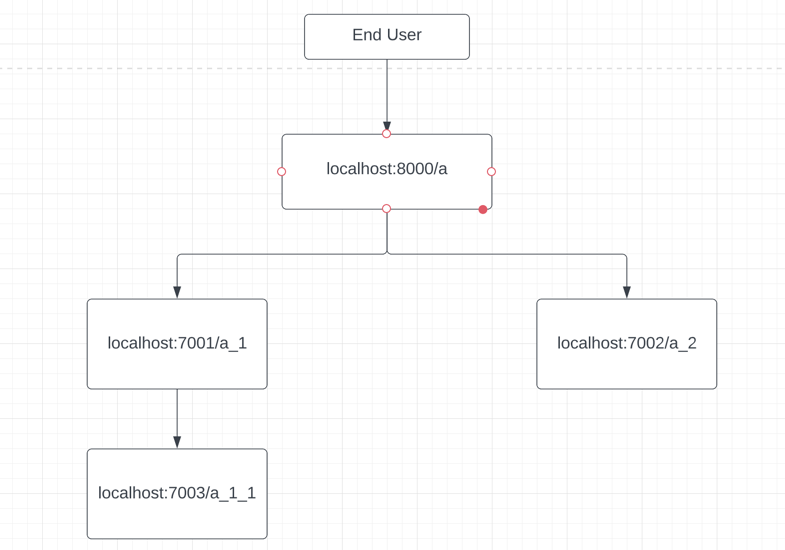
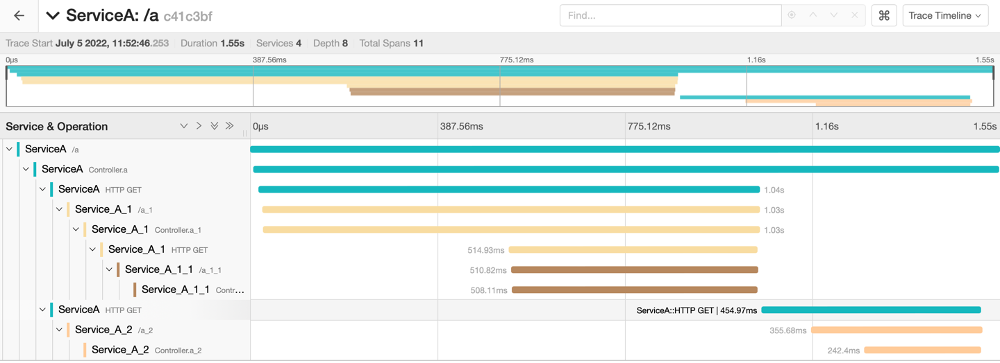
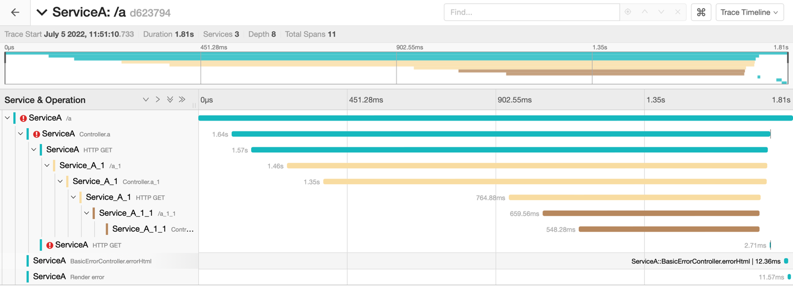

## Demo Microservice architecture

## Pre Requisites
- Jaeger running on port 16686
- [opentelemetry-javaagent.jar](https://github.com/open-telemetry/opentelemetry-java-instrumentation/releases/download/v1.12.0/opentelemetry-javaagent.jar)
    - View [Automatic Instrumentation Docs](https://opentelemetry.io/docs/instrumentation/java/automatic/) for more details
    - Download this jar and place in libraries folder
    
## Environment variables for all 4 applications
OTEL_TRACES_EXPORTER=jaeger;
OTEL_TRACES_EXPORTER_JAEGER_ENDPOINT=http://localhost:16686/
OTEL_SERVICE_NAME=<service-name>

## VM option for all 4 applications
-javaagent:libraries/opentelemetry-javaagent.jar

## Jaeger Output
- Hit localhost:8000/a

### Success

### Failure

## References
- [Java Instrumentation docs](https://opentelemetry.io/docs/instrumentation/java/)
- [Autoconfigure Jaeger exporter](https://github.com/open-telemetry/opentelemetry-java/blob/main/sdk-extensions/autoconfigure/README.md#jaeger-exporter)
- [Blog - Spring Implementation](https://reflectoring.io/spring-boot-tracing/)
- [Docs - Java implementation](https://github.com/open-telemetry/opentelemetry-java-docs/tree/main/jaeger)